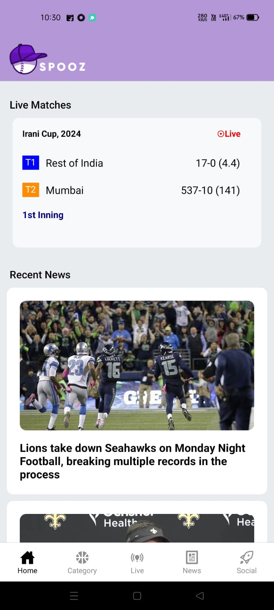

# Mobile Application Name

Brief description of your mobile application.

## Screenshots

### Home Screen
)

### Profile Screen

### Settings Screen

---

## How to Run

Instructions to run the application (optional, but helpful if this is for a code repository).

1. Step 1
2. Step 2
3. Step 3

## License

Include licensing information if necessary.
