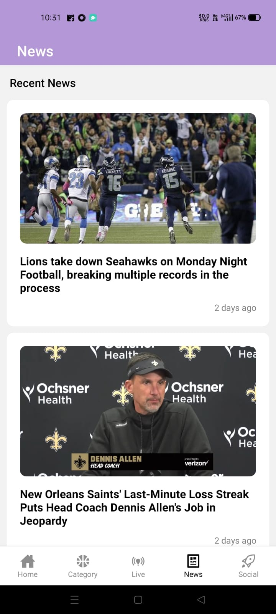
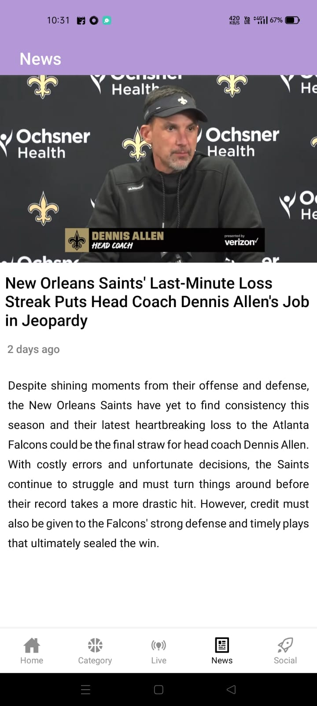
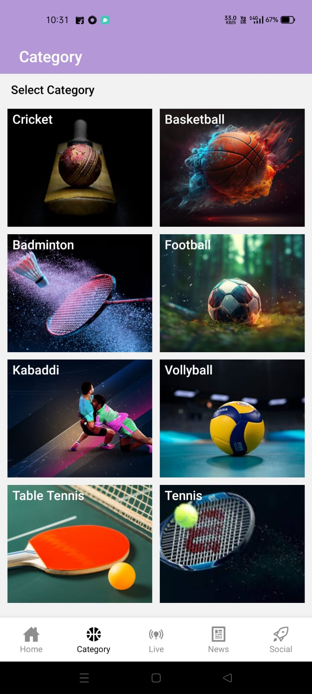
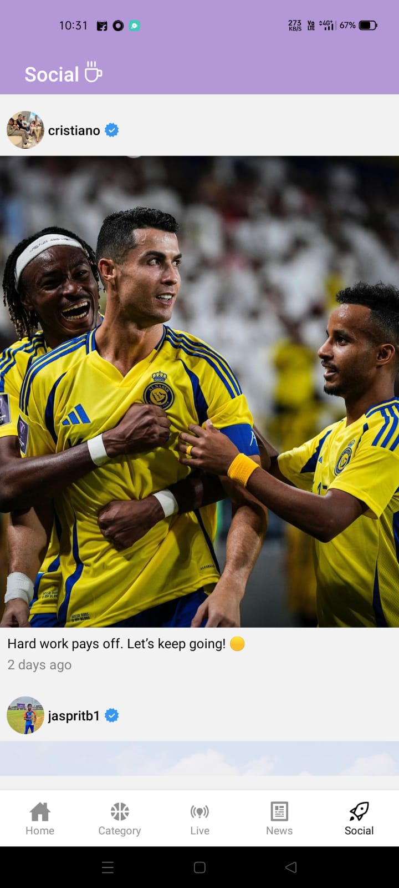

# Mobile Application Name

  <h2>– Built a mobile application that integrates live score multiple sports at one platform & supports 8 different sports categories.</h2>
   <h2>– Key features includes, dedicated sports categories, news section & social section to views athlete’s recent Instagram posts.</h2>
   <h2>– Push notification features is provided which can be scheduled & customized to provide short, timely information.</h2>

## Screenshots

